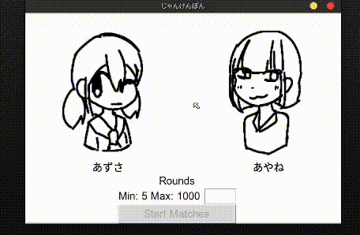

# じゃんけんぽん (Rock-Paper-Scissor)
じゃんけんぽん (Rock-Paper-Scissors in Japanese) is a program that allows users to bet on two characters (Though they use randomness not ML for now) they can either win or lose; that's it. 

### The Two Gakis'

 `Kyou Azusa`

 `Yamada Ayane`

*Not much reason why I chose these two characters since I drew them without thinking*

